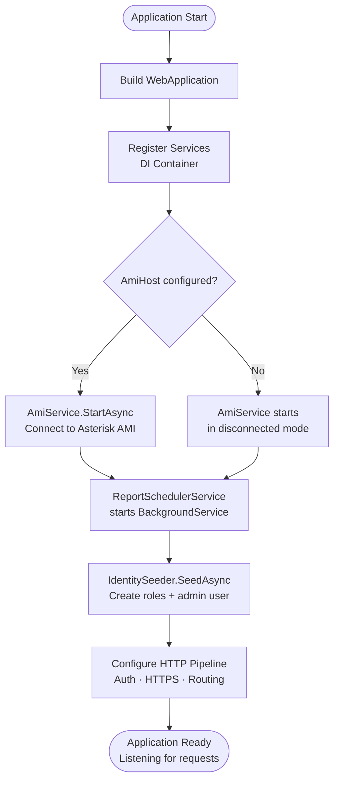
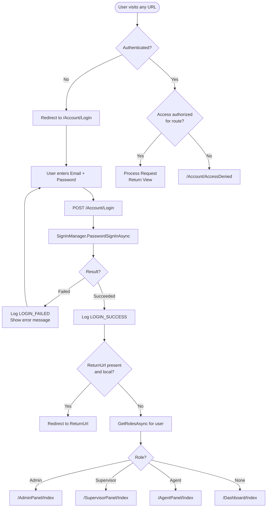
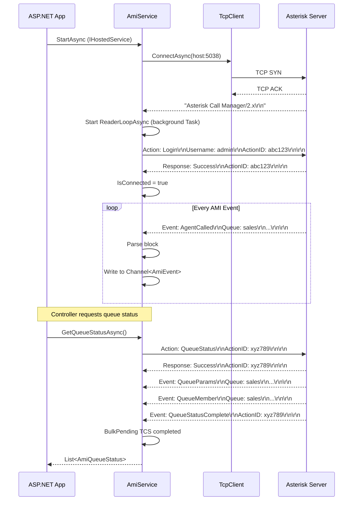
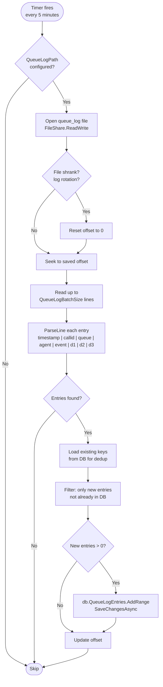
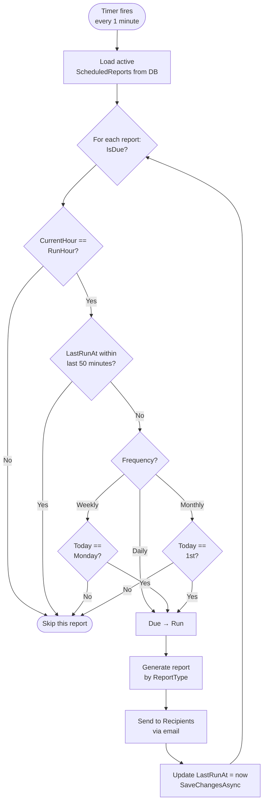
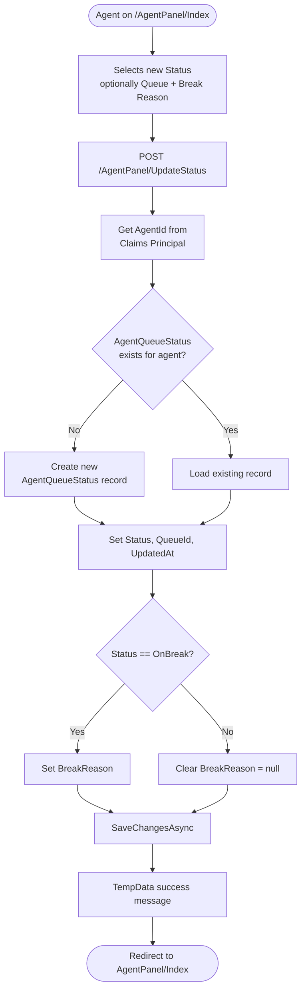
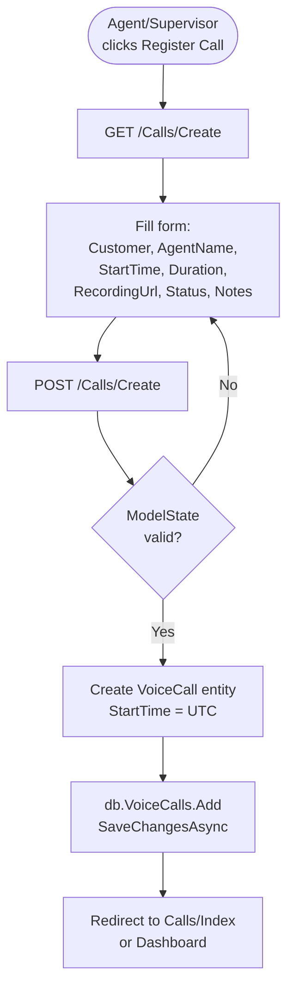
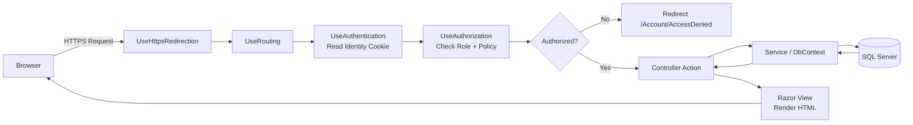

# CallCenterApp — System Technical Documentation

> **Version:** 1.0 · **Framework:** ASP.NET Core MVC (.NET 10) · **Database:** SQL Server  
> **Repository:** https://github.com/KsAmJ/CallCenterApp

---

## Table of Contents

1. [Project Overview](#1-project-overview)
2. [Technology Stack](#2-technology-stack)
3. [Architecture Overview](#3-architecture-overview)
4. [Security & Authentication Model](#4-security--authentication-model)
5. [Process Flow Diagrams](#5-process-flow-diagrams)
   - 5.1 [Application Startup Flow](#51-application-startup-flow)
   - 5.2 [Authentication & Role Routing Flow](#52-authentication--role-routing-flow)
   - 5.3 [AMI Connection & Event Lifecycle](#53-ami-connection--event-lifecycle)
   - 5.4 [Queue Log Import Flow](#54-queue-log-import-flow)
   - 5.5 [Scheduled Report Flow](#55-scheduled-report-flow)
   - 5.6 [Agent Status Update Flow](#56-agent-status-update-flow)
   - 5.7 [Call Registration Flow](#57-call-registration-flow)
6. [Request Lifecycle Flowchart](#6-request-lifecycle-flowchart)

---

## 1. Project Overview

**CallCenterApp** is a full-featured call center management platform built on ASP.NET Core MVC (.NET 10). It provides three distinct role-based portals — **Admin**, **Supervisor**, and **Agent** — backed by a SQL Server database and a real-time integration layer with an **Asterisk PBX** server via the Asterisk Manager Interface (AMI) protocol.

### Key Capabilities

| Capability | Description |
|---|---|
| Role-Based Portals | Separate UI experience per role (Admin / Supervisor / Agent) |
| PBX Integration | Real-time AMI TCP connection to Asterisk for live queue and agent control |
| Call Logging | Manual and AMI-driven call record management |
| Queue Management | Create, configure, and monitor Asterisk call queues |
| IVR Management | Define IVR menus with JSON-configured options |
| Routing Rules | Priority-based inbound call routing configuration |
| Subscription & Billing | Per-company subscription plans with billing metadata |
| Scheduled Reporting | Automated report generation (Daily / Weekly / Monthly) |
| Queue Log Import | Continuous file-based Asterisk `queue_log` ingestion |
| Audit Trail | Full user-action audit log with IP tracking |
| Export | Excel (ClosedXML) and PDF (QuestPDF) report exports |

---

## 2. Technology Stack

| Layer | Technology |
|---|---|
| Runtime | .NET 10 |
| Web Framework | ASP.NET Core MVC |
| Authentication | ASP.NET Core Identity |
| ORM | Entity Framework Core 10 |
| Database | Microsoft SQL Server |
| UI Styling | Bootstrap 5 |
| Excel Export | ClosedXML |
| PDF Export | QuestPDF (Community License) |
| PBX Integration | Asterisk Manager Interface (AMI) over raw TCP |
| Background Jobs | `IHostedService` / `BackgroundService` |
| Async Channels | `System.Threading.Channels` |

---

## 3. Architecture Overview

```
┌──────────────────────────────────────────────────────────────────┐
│                          Browser / Client                        │
└────────────────────────────┬─────────────────────────────────────┘
                             │  HTTPS
┌────────────────────────────▼─────────────────────────────────────┐
│                    ASP.NET Core MVC (.NET 10)                    │
│                                                                  │
│  ┌──────────────┐  ┌─────────────────┐  ┌────────────────────┐  │
│  │  Controllers │  │    ViewModels   │  │      Views         │  │
│  │  (12 total)  │  │   (10 total)    │  │   (Razor .cshtml)  │  │
│  └──────┬───────┘  └────────┬────────┘  └────────────────────┘  │
│         │                   │                                     │
│  ┌──────▼───────────────────▼──────────────────────────────────┐ │
│  │                     Service Layer                           │ │
│  │  ┌──────────────┐  ┌───────────────┐  ┌─────────────────┐  │ │
│  │  │  AmiService  │  │ QueueLogSvc   │  │  AuditLogSvc    │  │ │
│  │  │ (IHostedSvc) │  │  (Scoped)     │  │   (Scoped)      │  │ │
│  │  └──────┬───────┘  └───────┬───────┘  └────────┬────────┘  │ │
│  │         │                  │                    │           │ │
│  │  ┌──────▼──────────────────▼────────────────────▼────────┐  │ │
│  │  │             ReportSchedulerService (BackgroundSvc)    │  │ │
│  │  └───────────────────────────────────────────────────────┘  │ │
│  └──────────────────────────────┬──────────────────────────────┘ │
│                                 │                                 │
│  ┌──────────────────────────────▼──────────────────────────────┐ │
│  │             Data Layer  (Entity Framework Core)             │ │
│  │                    CallCenterDbContext                       │ │
│  └──────────────────────────────┬──────────────────────────────┘ │
└─────────────────────────────────┼────────────────────────────────┘
                                  │  ADO.NET / TDS
┌─────────────────────────────────▼────────────────────────────────┐
│                     SQL Server  (CallCenterDb)                   │
│         Tables · Views · Stored Procedures · Indexes             │
└──────────────────────────────────────────────────────────────────┘

                    ┌─────────────────────────┐
                    │      Asterisk PBX        │
                    │  manager.conf (TCP 5038) │
                    └────────────┬────────────┘
                                 │  AMI Protocol (TCP)
                    ┌────────────▼────────────┐
                    │   AmiService (Singleton) │
                    │   - Persistent TCP conn  │
                    │   - Async reader loop    │
                    │   - Channel<AmiEvent>    │
                    └─────────────────────────┘
```

---

## 4. Security & Authentication Model

### Identity Setup

- Powered by **ASP.NET Core Identity** with a custom `ApplicationUser` class extending `IdentityUser`.
- Password policy: minimum 8 characters, requires digit, uppercase, and non-alphanumeric character.
- Unique email enforced per user.
- Default admin user seeded at startup: `admin@callcenter.local` / `Admin#12345`.

### Roles

| Role | Constant | Default Portal |
|---|---|---|
| `Admin` | `Roles.Admin` | `/AdminPanel` |
| `Supervisor` | `Roles.Supervisor` | `/SupervisorPanel` |
| `Agent` | `Roles.Agent` | `/AgentPanel` |

### Global Authorization Policy

All routes require authentication by default via a global `AuthorizeFilter`. Public routes (`/Account/Login`, `/Account/AccessDenied`) are decorated with `[AllowAnonymous]`.

### Controller-Level Authorization

| Controller | Allowed Roles |
|---|---|
| `AccountController` | All (login is `[AllowAnonymous]`), user management = Admin only |
| `AdminPanelController` | Admin |
| `SupervisorPanelController` | Admin, Supervisor |
| `AgentPanelController` | Agent |
| `AmiMonitorController` | Admin, Supervisor |
| `ReportsController` | Admin, Supervisor |
| `DashboardController` | Admin, Supervisor, Agent |
| `AuditLogsController` | Admin |
| `CallsController` | Admin, Supervisor |
| `CompaniesController` | Admin, Supervisor |
| `CustomersController` | Admin, Supervisor |

### CSRF Protection

All `[HttpPost]` actions are decorated with `[ValidateAntiForgeryToken]`. All forms include `@Html.AntiForgeryToken()`.

### Audit Trail

Every significant user action (login, logout, role change, data export) is recorded in the `AuditLogs` table via `IAuditLogService`, capturing: `Action`, `UserId`, `UserEmail`, `EntityName`, `EntityId`, `IpAddress`, `Details`, `CreatedAtUtc`.

---

## 5. Process Flow Diagrams

### 5.1 Application Startup Flow



---

### 5.2 Authentication & Role Routing Flow



---

### 5.3 AMI Connection & Event Lifecycle



---

### 5.4 Queue Log Import Flow



---

### 5.5 Scheduled Report Flow



---

### 5.6 Agent Status Update Flow



---

### 5.7 Call Registration Flow



---

## 6. Request Lifecycle Flowchart



---

